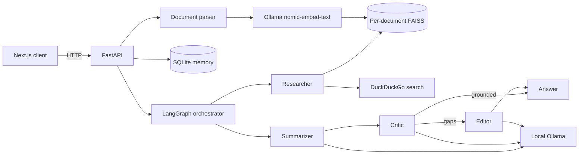

# Architecture

## Goals

The system answers questions from private files, the public web, or both while keeping model inference and document processing local. Its central design goal is inspectable evidence: retrieval is separate from synthesis, web provenance is returned as structured data, and a critic gates the final edit.

## System context

## Request flow

1. FastAPI validates a PDF, DOCX, HTML, or TXT upload.
2. The parser extracts and chunks text.
3. Ollama's open-source `nomic-embed-text` model embeds chunks locally; vectors are stored in an isolated FAISS index with metadata.
4. A question selects `documents`, `web`, or `hybrid` mode.
5. The Researcher retrieves document chunks, DuckDuckGo result snippets, or both.
6. Web evidence is labeled `[n]` and retained as structured provenance (`title`, `url`, `snippet`, `retrieved_at`).
7. The Summarizer drafts only from retrieved evidence.
8. The Critic checks support, missing facts, uncertainty, and citation alignment.
9. Conditional LangGraph routing invokes the Editor only when gaps are detected.
10. FastAPI stores the turn and workflow metadata in SQLite and returns the answer, trace, and sources.

## Component boundaries

| Area | Responsibility |
|---|---|
| `frontend/` | Research mode, document scope, chat, trace, and clickable sources |
| `backend/main.py` | HTTP validation, upload lifecycle, sessions, response shaping |
| `backend/agents/` | Agent prompts, graph state, conditional orchestration |
| `backend/services/` | External retrieval adapters such as DuckDuckGo |
| `backend/utils/` | parsing, local embedding adapter, logging |
| `backend/db/` | FAISS persistence, per-document metadata, SQLite memory |
| `backend/llm_client.py` | Native Ollama transport and actionable readiness errors |

## Data and trust boundaries

- **Local:** uploaded content, extracted chunks, embeddings, indexes, prompts, answers, and conversation history.
- **Network only in Web/Hybrid:** the user's search query and DuckDuckGo results.
- **No secrets:** Ollama and Sentence Transformers require no provider credentials.
- **Generated state:** `backend/db/documents`, SQLite files, logs, caches, `.env`, `.next`, and virtual environments are gitignored.

## Key decisions and trade-offs

- Using Ollama for both chat and embeddings keeps setup small and fully local, while requiring both models to be pulled before going offline.
- Ollama's native API removes OpenAI-compatible shims and key-shaped configuration, but latency depends on local hardware and model size.
- DuckDuckGo snippets make research fast and attributable without a search key. They are discovery evidence, not full-page verification; production work should add safe page fetching, content extraction, and domain allow/block policies.
- Per-document FAISS indexes simplify deletion and selection but searching many indexes is less efficient than a single filtered collection.
- SQLite is ideal for a single-machine demonstration; concurrent multi-user deployment would need a server database.

## Extension path

Useful next steps are streaming graph events over SSE, reciprocal-rank fusion for hybrid retrieval, full-page extraction with SSRF protection, reranking, evaluation datasets for faithfulness/citation precision, and model/index fingerprints that automatically detect incompatible embeddings.
